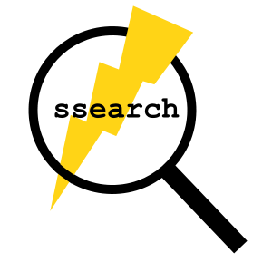

# Welcome to Super Search 👋

[](https://img.shields.io/crates/v/ssearch)
[](/LICENSE.md)



*Mouse-less-ishly search websites using CLI.*
* Search Google using `ssearch --go How to rust`
* Search GitHub using `ssearch --gh rust`

...and so on

## Installation
```shell script
cargo install ssearch
```

## Usage

| Operation   |      Syntax      |  Example |
|------------|-------------------|------------|
| Adding keywords |   `ssearch add -k <keyword> -q <query-url> -d <description>`|     <code>ssearch add  -k rd \ <br> -q https://www.reddit.com/r/rust/search/?q= \ <br> -d Reddit Search</code>  |
| Searching |    `ssearch --<keyword> <your-query>`   |   `ssearch --rd how to rust` |
| Deleting keyword | `ssearch del -k <keyword>` |    `ssearch del -k rd` |
| Getting help | `ssearch help` |     |
| List all keywords | `ssearch ls` |     |




## During development
Run super search directly from terminal 
```shell script
cargo run -- <pass arguments here>
```
Examples:
```shell script
cargo run -- --help
cargo run -- --yt How to rust
cargo run -- add -k rd -q https://www.reddit.com/r/rust/search/?q= -d Reddit Search
```
